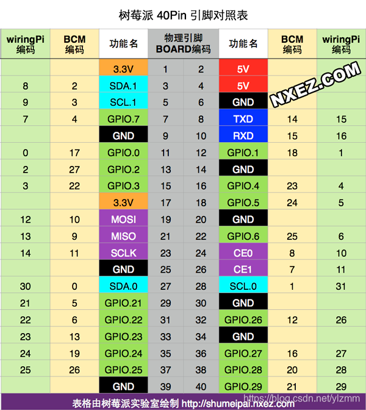

## PWM

树莓派的硬件引脚PWM有4个引脚。GPIO.1、GPIO.26、GPIO.23、GPIO.24，对应到WiringPi就是1、26、23、24。查看引脚可以使用网站[pinout](https://pinout.vvzero.com/pinout/pwm)



### wiringPi

wiringPi 使用的硬件PWM，也可以软件PWM输出，c文件名我命名为main.c

树莓派内部pwm发生器的基频为19.2MHz，输出频率 **freq(Hz) = 19200000 / divisor / range**；

硬件PWM有个问题就是，1和26会同时设置，23和24会同时设置，暂时不知道为什么。

```c
#include <wiringPi.h>
#include <stdio.h>

#define PWM 1

int main(int argc,char **argv)
{   
    if(wiringPiSetup() < 0) //当使用这个函数初始化树莓派引脚时，程序使用的是wiringPi 引脚编号表。
        return 1;
    
    pinMode(PWM,PWM_OUTPUT); //设置引脚为PWM输出模式
    pwmSetMode (PWM_MODE_MS);
    pwmSetRange(1024);              // pwm脉宽范围 0~1024
    pwmSetClock(75);                // 250Hz，19.2MHz / 75 / 1024 = 250Hz
    pwmWrite(PWM,512);              // 设置占空比

    while (1)
    {

    }
    return 0;
}
```

然后编译这段代码

```bash
cc -Wall -o main main.c -lwiringPi
```

 -Wall 表示编译时显示所有警告，-lwiringPi 表示编译时动态加载 wiringPi 库

编译完成后调用生成的main文件

```bash
sudo ./main
```

然后可以用示波器啥的，或者自己连接的LED灯在这个引脚上，就可以查看到变化。、

想要停止这个程序，`Ctrl+c`即可。

除了硬件PWM，该库还支持软件PWM的输出，具体实现如下

```c
#include <wiringPi.h>
#include <stdio.h>

#include <softPwm.h>

#define PWM 4

int main(int argc,char **argv)
{   
    if(wiringPiSetup() < 0) //当使用这个函数初始化树莓派引脚时，程序使用的是wiringPi 引脚编号表。
        return 1;
    
    pinMode(PWM,OUTPUT); //设置引脚为 输出模式
    //PWMfreq = 1 x 10^6 / (100 x range)  需要50hz 
    softPwmCreate(PWM , 0, 200);// 设置周期分为200份
    softPwmWrite(PWM , 50);

    while (1)
    {

    }
    return 0;
}
```

### bcm2835库

bcm的引脚编号和wiringPi不同，注意，下面是一个实际例子

```c
#include <bcm2835.h>

#define PWM 18
#define PWM_CHANNEL 0

int main(int argc,char **argv)
{
    if(!bcm2835_init()) //初始化BCM相关的
        return 1;

    // 配置引脚为PWM输出模式
    bcm2835_gpio_fsel(PWM, BCM2835_GPIO_FSEL_ALT5);
    
    // 时钟分频设置为16. 19.2Mhz/16 = 1.2Mhz
    bcm2835_pwm_set_clock(BCM2835_PWM_CLOCK_DIVIDER_16);
    // 设置模式
    bcm2835_pwm_set_mode(PWM_CHANNEL, 1, 1);
    // 1.2MHz/1024 = 1171.875Hz,  设置计数值
    bcm2835_pwm_set_range(PWM_CHANNEL, 1024);
    bcm2835_pwm_set_data(PWM_CHANNEL, 256);

    while(1)
    {
         
    }
    
    bcm2835_close();
    return 0;
}
```

然后编译这段代码

```bash
gcc -Wall main.c -o main -lbcm2835
```

 -Wall 表示编译时显示所有警告，-lbcm2835 表示编译时动态加载bcm2835 库

编译完成后调用生成的main文件

```bash
sudo ./main
```

然后可以用示波器啥的，或者自己连接的LED灯在这个引脚上，就可以查看到变化。、

想要停止这个程序，`Ctrl+c`即可。

### RPi.GPIO

直接给代码了，python应该比较好理解，python硬件只能设置BCM编号18的引脚

```python
#!/usr/bin/python
# -*- coding:utf-8 -*-
import RPi.GPIO as GPIO
import time

PWM = 18
 
GPIO.setmode(GPIO.BCM)  #设置编号方式
GPIO.setup(PWM, GPIO.OUT)  #设置 引脚为输出模式

p = GPIO.PWM(PWM, 50)  #将 引脚初始化为PWM实例 ，频率为50Hz
p.start(0)    #开始脉宽调制，参数范围为： (0.0 <= dc <= 100.0)

try:
    while 1:
        for dc in range(0, 101, 5):
            p.ChangeDutyCycle(dc)   #修改占空比 参数范围为： (0.0 <= dc <= 100.0)
            time.sleep(0.1)
        for dc in range(100, -1, -5):
            p.ChangeDutyCycle(dc)
            time.sleep(0.1)
except KeyboardInterrupt:
    pass

p.stop()    #停止输出PWM波
GPIO.cleanup()    #清除
```

